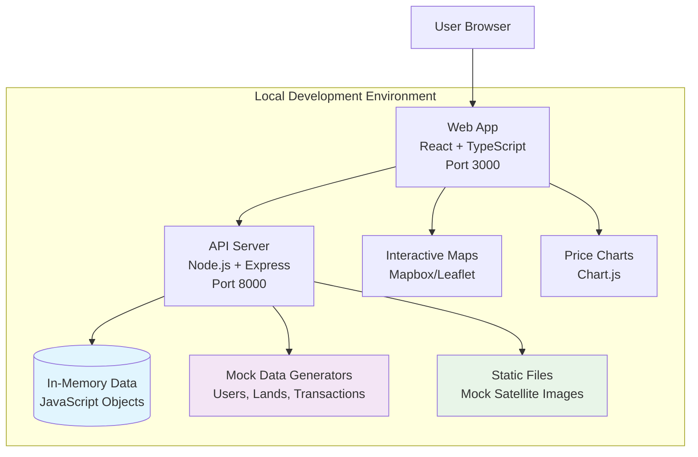
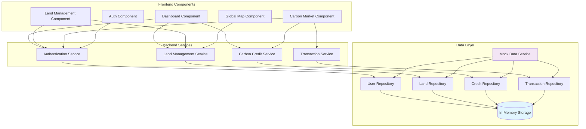
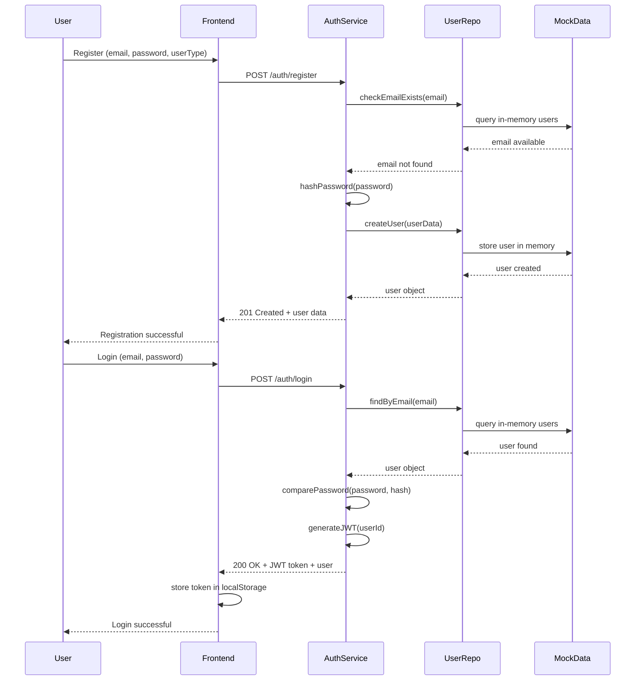
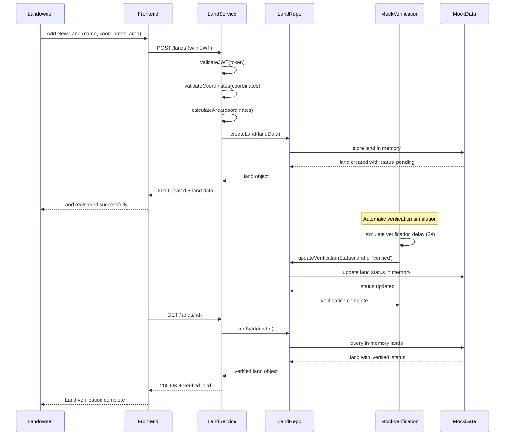
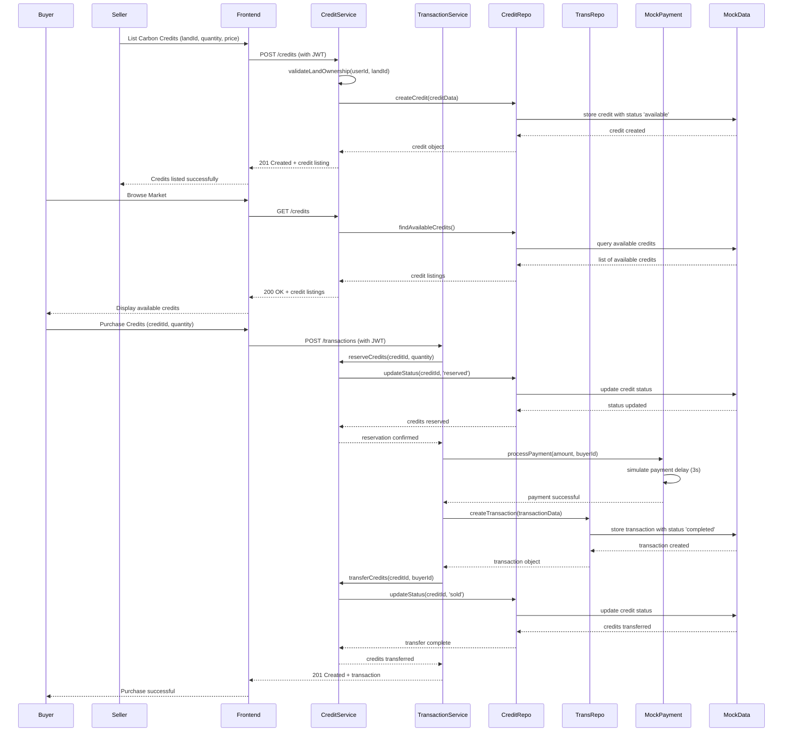
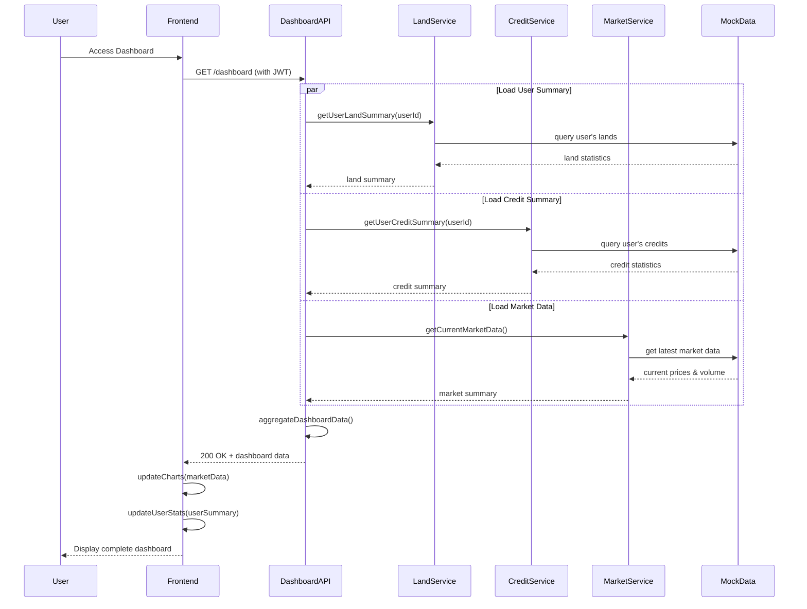
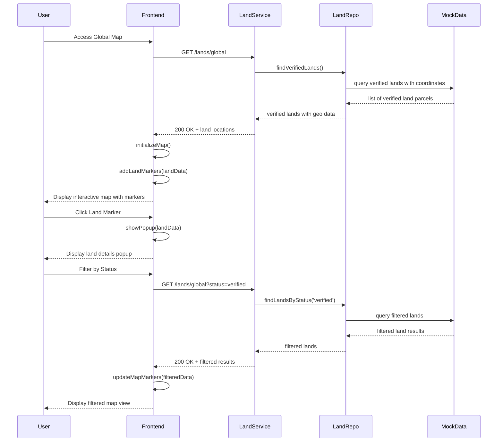
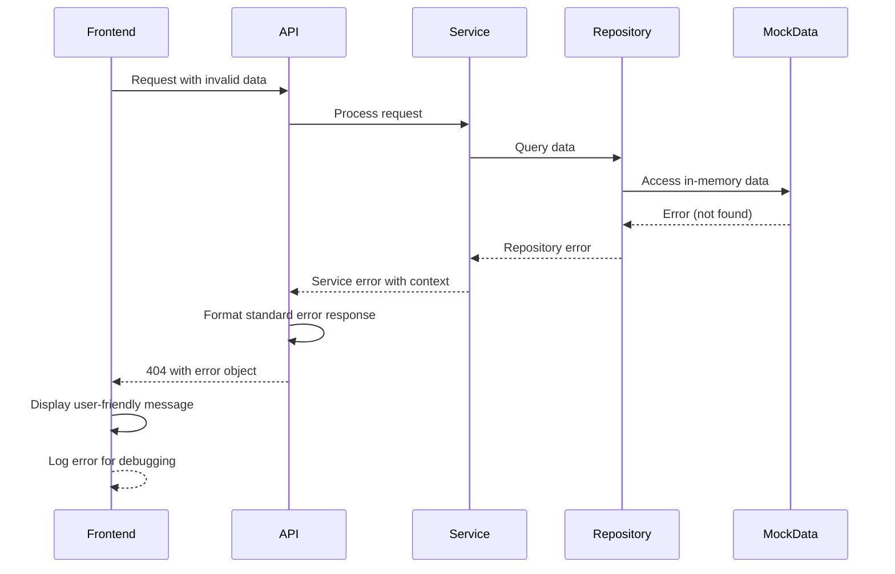

# TerraVue Fullstack Architecture Document

## Introduction

This document outlines the complete fullstack architecture for TerraVue, including backend systems, frontend implementation, and their integration. It serves as the single source of truth for AI-driven development, ensuring consistency across the entire technology stack.

This unified approach combines what would traditionally be separate backend and frontend architecture documents, streamlining the development process for modern fullstack applications where these concerns are increasingly intertwined.

### Starter Template or Existing Project

**N/A - Greenfield project**

Based on the PRD requirements for a dummy-data-only MVP with native local development, this is a greenfield project that will be built from scratch without any existing starter templates or codebases. The architecture is designed specifically for rapid prototyping with in-memory data storage and mock integrations.

### Change Log

| Date | Version | Description | Author |
|------|---------|-------------|---------|
| 2024-10-10 | 1.0 | Initial architecture creation for TerraVue MVP | Architect Agent |

## High Level Architecture

### Technical Summary

TerraVue MVP employs a **monorepo fullstack architecture** with React/TypeScript frontend and Node.js/Express backend, utilizing **in-memory data storage** for rapid prototyping without database dependencies. The frontend implements a **dashboard-first, map-centric design** with stock-trading-style interfaces, while the backend provides **RESTful APIs with mock data generators** for realistic carbon market simulation. The architecture supports **native local development** with simple npm commands, **zero external dependencies**, and **complete self-containment** for immediate development startup. All integrations (satellite imagery, payments, notifications) are **fully simulated** to demonstrate complete functionality while maintaining development simplicity.

### Platform and Infrastructure Choice

**Platform:** Local Development Environment  
**Key Services:** Node.js runtime, npm package manager, local file system  
**Deployment Host and Regions:** localhost:3000 (frontend), localhost:8000 (backend)

### Repository Structure

**Structure:** Monorepo  
**Monorepo Tool:** npm workspaces (built-in, zero configuration)  
**Package Organization:** Apps (web, api) + Shared packages (types, utils, mock-data)

### High Level Architecture Diagram



### Architectural Patterns

- **Jamstack Architecture:** Static frontend with API backend - _Rationale:_ Clear separation of concerns and optimal development experience for MVP
- **Component-Based UI:** Reusable React components with TypeScript - _Rationale:_ Maintainability and type safety across the carbon market interface
- **Repository Pattern:** Abstract data access logic - _Rationale:_ Enables easy transition from in-memory to real database later
- **Mock Service Pattern:** Simulated external services - _Rationale:_ Complete functionality demonstration without external dependencies
- **RESTful API Design:** Standard HTTP endpoints - _Rationale:_ Simple, well-understood pattern for rapid development
- **In-Memory State Management:** JavaScript objects for data persistence - _Rationale:_ Zero configuration, instant startup, perfect for prototyping

## Tech Stack

### Technology Stack Table

| Category | Technology | Version | Purpose | Rationale |
|----------|------------|---------|---------|-----------|
| Frontend Language | TypeScript | 5.2+ | Type-safe JavaScript development | Prevents runtime errors, improves developer experience, enables better IDE support |
| Frontend Framework | React | 18.2+ | UI component library | Industry standard, excellent ecosystem, perfect for interactive dashboards |
| UI Component Library | Material-UI (MUI) | 5.14+ | Pre-built components | Rapid development, professional appearance, extensive component library |
| State Management | Zustand | 4.4+ | Lightweight state management | Simple API, TypeScript-first, perfect for MVP without Redux complexity |
| Backend Language | TypeScript | 5.2+ | Type-safe server development | Shared types with frontend, better error catching, consistent codebase |
| Backend Framework | Express.js | 4.18+ | Web application framework | Minimal, flexible, extensive middleware ecosystem |
| API Style | REST | N/A | HTTP-based API design | Simple, well-understood, easy to test and debug |
| Database | In-Memory Objects | N/A | Runtime data storage | Zero configuration, instant startup, perfect for MVP prototyping |
| Cache | In-Memory Maps | N/A | Application-level caching | Built into JavaScript runtime, no external dependencies |
| File Storage | Local File System | N/A | Static asset storage | Simple, no external services, perfect for mock data |
| Authentication | JWT + bcrypt | jwt: 9.0+, bcrypt: 5.1+ | Local authentication | Stateless, secure, no external auth services needed |
| Frontend Testing | Vitest + Testing Library | vitest: 0.34+, @testing-library/react: 13.4+ | Component and unit testing | Fast, modern testing framework with great TypeScript support |
| Backend Testing | Vitest + Supertest | vitest: 0.34+, supertest: 6.3+ | API testing | Consistent testing framework across frontend and backend |
| E2E Testing | Playwright | 1.37+ | End-to-end testing | Reliable, fast, excellent debugging tools |
| Build Tool | Vite | 4.4+ | Frontend build and dev server | Fast HMR, excellent TypeScript support, modern tooling |
| Bundler | Vite (Rollup) | 4.4+ | Production bundling | Built into Vite, optimized for modern browsers |
| IaC Tool | N/A | N/A | Infrastructure as Code | Not needed for local development MVP |
| CI/CD | GitHub Actions | N/A | Continuous integration | Free for public repos, excellent GitHub integration |
| Monitoring | Console Logging | N/A | Application monitoring | Simple logging for development, no external services |
| Logging | Winston | 3.10+ | Structured logging | Professional logging with levels and formatting |
| CSS Framework | Tailwind CSS | 3.3+ | Utility-first CSS | Rapid styling, consistent design system, excellent with React |

## Data Models

### User

**Purpose:** Represents platform users with role-based access (landowners and buyers)

**Key Attributes:**
- id: string - Unique identifier
- email: string - User email address
- password: string - Hashed password
- fullName: string - User's full name
- userType: 'landowner' | 'buyer' - Role-based access control
- createdAt: Date - Account creation timestamp
- lastLogin: Date - Last login timestamp

#### TypeScript Interface
```typescript
interface User {
  id: string;
  email: string;
  password: string; // hashed
  fullName: string;
  userType: 'landowner' | 'buyer';
  createdAt: Date;
  lastLogin?: Date;
}
```

#### Relationships
- One-to-many with LandParcel (for landowners)
- One-to-many with Transaction (as buyer or seller)

### LandParcel

**Purpose:** Represents forest land parcels that can generate carbon credits

**Key Attributes:**
- id: string - Unique identifier
- ownerId: string - Reference to User
- name: string - Land parcel name
- coordinates: GeoCoordinate[] - Boundary coordinates
- area: number - Area in hectares
- landType: string - Forest type classification
- verificationStatus: 'pending' | 'verified' | 'rejected' - Verification state
- carbonPotential: number - Estimated carbon credits per year
- createdAt: Date - Registration timestamp

#### TypeScript Interface
```typescript
interface GeoCoordinate {
  lat: number;
  lng: number;
}

interface LandParcel {
  id: string;
  ownerId: string;
  name: string;
  coordinates: GeoCoordinate[];
  area: number; // hectares
  landType: string;
  verificationStatus: 'pending' | 'verified' | 'rejected';
  carbonPotential: number; // credits per year
  createdAt: Date;
  updatedAt: Date;
}
```

#### Relationships
- Many-to-one with User (owner)
- One-to-many with CarbonCredit

### CarbonCredit

**Purpose:** Represents tradeable carbon credits generated from verified land

**Key Attributes:**
- id: string - Unique identifier
- landParcelId: string - Source land parcel
- quantity: number - Number of credits
- pricePerCredit: number - Price in IDR
- status: 'available' | 'sold' | 'reserved' - Trading status
- validUntil: Date - Credit expiration date
- createdAt: Date - Listing timestamp

#### TypeScript Interface
```typescript
interface CarbonCredit {
  id: string;
  landParcelId: string;
  quantity: number;
  pricePerCredit: number; // IDR
  status: 'available' | 'sold' | 'reserved';
  validUntil: Date;
  createdAt: Date;
}
```

#### Relationships
- Many-to-one with LandParcel
- One-to-many with Transaction

### Transaction

**Purpose:** Records carbon credit purchase transactions

**Key Attributes:**
- id: string - Unique identifier
- buyerId: string - Purchasing user
- sellerId: string - Selling user (landowner)
- carbonCreditId: string - Purchased credits
- quantity: number - Credits purchased
- totalAmount: number - Total price paid
- status: 'pending' | 'completed' | 'failed' - Transaction status
- createdAt: Date - Transaction timestamp

#### TypeScript Interface
```typescript
interface Transaction {
  id: string;
  buyerId: string;
  sellerId: string;
  carbonCreditId: string;
  quantity: number;
  totalAmount: number; // IDR
  status: 'pending' | 'completed' | 'failed';
  createdAt: Date;
  completedAt?: Date;
}
```

#### Relationships
- Many-to-one with User (buyer)
- Many-to-one with User (seller)
- Many-to-one with CarbonCredit

### MarketData

**Purpose:** Stores carbon market pricing and analytics data

**Key Attributes:**
- id: string - Unique identifier
- timestamp: Date - Data point timestamp
- averagePrice: number - Market average price
- volume: number - Trading volume
- priceChange: number - Price change percentage
- region: string - Geographic region

#### TypeScript Interface
```typescript
interface MarketData {
  id: string;
  timestamp: Date;
  averagePrice: number; // IDR per credit
  volume: number; // credits traded
  priceChange: number; // percentage
  region: string;
}
```

#### Relationships
- Standalone entity for analytics

## API Specification

### REST API Specification

```yaml
openapi: 3.0.0
info:
  title: TerraVue Carbon Market API
  version: 1.0.0
  description: RESTful API for Indonesian carbon market platform with in-memory data storage
servers:
  - url: http://localhost:8000/api/v1
    description: Local development server

components:
  securitySchemes:
    BearerAuth:
      type: http
      scheme: bearer
      bearerFormat: JWT
  
  schemas:
    User:
      type: object
      properties:
        id:
          type: string
        email:
          type: string
          format: email
        fullName:
          type: string
        userType:
          type: string
          enum: [landowner, buyer]
        createdAt:
          type: string
          format: date-time
        lastLogin:
          type: string
          format: date-time
    
    LandParcel:
      type: object
      properties:
        id:
          type: string
        ownerId:
          type: string
        name:
          type: string
        coordinates:
          type: array
          items:
            type: object
            properties:
              lat:
                type: number
              lng:
                type: number
        area:
          type: number
        landType:
          type: string
        verificationStatus:
          type: string
          enum: [pending, verified, rejected]
        carbonPotential:
          type: number
        createdAt:
          type: string
          format: date-time
    
    CarbonCredit:
      type: object
      properties:
        id:
          type: string
        landParcelId:
          type: string
        quantity:
          type: number
        pricePerCredit:
          type: number
        status:
          type: string
          enum: [available, sold, reserved]
        validUntil:
          type: string
          format: date-time
        createdAt:
          type: string
          format: date-time
    
    Transaction:
      type: object
      properties:
        id:
          type: string
        buyerId:
          type: string
        sellerId:
          type: string
        carbonCreditId:
          type: string
        quantity:
          type: number
        totalAmount:
          type: number
        status:
          type: string
          enum: [pending, completed, failed]
        createdAt:
          type: string
          format: date-time
    
    MarketData:
      type: object
      properties:
        id:
          type: string
        timestamp:
          type: string
          format: date-time
        averagePrice:
          type: number
        volume:
          type: number
        priceChange:
          type: number
        region:
          type: string

paths:
  # Authentication Endpoints
  /auth/register:
    post:
      summary: Register new user
      requestBody:
        required: true
        content:
          application/json:
            schema:
              type: object
              properties:
                email:
                  type: string
                password:
                  type: string
                fullName:
                  type: string
                userType:
                  type: string
                  enum: [landowner, buyer]
      responses:
        '201':
          description: User registered successfully
          content:
            application/json:
              schema:
                $ref: '#/components/schemas/User'
  
  /auth/login:
    post:
      summary: User login
      requestBody:
        required: true
        content:
          application/json:
            schema:
              type: object
              properties:
                email:
                  type: string
                password:
                  type: string
      responses:
        '200':
          description: Login successful
          content:
            application/json:
              schema:
                type: object
                properties:
                  token:
                    type: string
                  user:
                    $ref: '#/components/schemas/User'
  
  # Land Management Endpoints
  /lands:
    get:
      summary: Get user's land parcels
      security:
        - BearerAuth: []
      responses:
        '200':
          description: List of land parcels
          content:
            application/json:
              schema:
                type: array
                items:
                  $ref: '#/components/schemas/LandParcel'
    
    post:
      summary: Register new land parcel
      security:
        - BearerAuth: []
      requestBody:
        required: true
        content:
          application/json:
            schema:
              type: object
              properties:
                name:
                  type: string
                coordinates:
                  type: array
                  items:
                    type: object
                    properties:
                      lat:
                        type: number
                      lng:
                        type: number
                area:
                  type: number
                landType:
                  type: string
      responses:
        '201':
          description: Land parcel registered
          content:
            application/json:
              schema:
                $ref: '#/components/schemas/LandParcel'
  
  /lands/{id}:
    get:
      summary: Get land parcel details
      security:
        - BearerAuth: []
      parameters:
        - name: id
          in: path
          required: true
          schema:
            type: string
      responses:
        '200':
          description: Land parcel details
          content:
            application/json:
              schema:
                $ref: '#/components/schemas/LandParcel'
  
  # Global Map Endpoints
  /lands/global:
    get:
      summary: Get all verified land parcels for global map
      responses:
        '200':
          description: List of verified land parcels
          content:
            application/json:
              schema:
                type: array
                items:
                  $ref: '#/components/schemas/LandParcel'
  
  # Carbon Credit Endpoints
  /credits:
    get:
      summary: Get available carbon credits
      parameters:
        - name: status
          in: query
          schema:
            type: string
            enum: [available, sold, reserved]
        - name: minPrice
          in: query
          schema:
            type: number
        - name: maxPrice
          in: query
          schema:
            type: number
      responses:
        '200':
          description: List of carbon credits
          content:
            application/json:
              schema:
                type: array
                items:
                  $ref: '#/components/schemas/CarbonCredit'
    
    post:
      summary: List carbon credits for sale
      security:
        - BearerAuth: []
      requestBody:
        required: true
        content:
          application/json:
            schema:
              type: object
              properties:
                landParcelId:
                  type: string
                quantity:
                  type: number
                pricePerCredit:
                  type: number
                validUntil:
                  type: string
                  format: date-time
      responses:
        '201':
          description: Carbon credits listed
          content:
            application/json:
              schema:
                $ref: '#/components/schemas/CarbonCredit'
  
  # Transaction Endpoints
  /transactions:
    get:
      summary: Get user's transaction history
      security:
        - BearerAuth: []
      responses:
        '200':
          description: List of transactions
          content:
            application/json:
              schema:
                type: array
                items:
                  $ref: '#/components/schemas/Transaction'
    
    post:
      summary: Purchase carbon credits
      security:
        - BearerAuth: []
      requestBody:
        required: true
        content:
          application/json:
            schema:
              type: object
              properties:
                carbonCreditId:
                  type: string
                quantity:
                  type: number
      responses:
        '201':
          description: Transaction created
          content:
            application/json:
              schema:
                $ref: '#/components/schemas/Transaction'
  
  # Market Data Endpoints
  /market/data:
    get:
      summary: Get market pricing data
      parameters:
        - name: period
          in: query
          schema:
            type: string
            enum: [1d, 7d, 30d, 90d]
            default: 7d
        - name: region
          in: query
          schema:
            type: string
      responses:
        '200':
          description: Market data points
          content:
            application/json:
              schema:
                type: array
                items:
                  $ref: '#/components/schemas/MarketData'
  
  /market/summary:
    get:
      summary: Get current market summary
      responses:
        '200':
          description: Market summary statistics
          content:
            application/json:
              schema:
                type: object
                properties:
                  currentPrice:
                    type: number
                  priceChange24h:
                    type: number
                  volume24h:
                    type: number
                  totalCreditsAvailable:
                    type: number
  
  # Dashboard Endpoints
  /dashboard:
    get:
      summary: Get dashboard data for authenticated user
      security:
        - BearerAuth: []
      responses:
        '200':
          description: Dashboard data
          content:
            application/json:
              schema:
                type: object
                properties:
                  userSummary:
                    type: object
                    properties:
                      totalLands:
                        type: number
                      verifiedLands:
                        type: number
                      totalCredits:
                        type: number
                      totalTransactions:
                        type: number
                  marketSummary:
                    type: object
                    properties:
                      currentPrice:
                        type: number
                      priceChange:
                        type: number
                      volume:
                        type: number
                  recentActivity:
                    type: array
                    items:
                      type: object
                      properties:
                        type:
                          type: string
                        description:
                          type: string
                        timestamp:
                          type: string
                          format: date-time
```

## Components

### Frontend Components

#### Dashboard Component

**Responsibility:** Main landing page displaying carbon market overview, user statistics, and quick actions

**Key Interfaces:**
- `/api/v1/dashboard` - Fetch dashboard data
- `/api/v1/market/summary` - Get market summary
- Navigation to other sections

**Dependencies:** AuthService, MarketDataService, UserService

**Technology Stack:** React + TypeScript, MUI components, Zustand for state, Chart.js for visualizations

#### Land Management Component

**Responsibility:** Complete land parcel management including listing, registration, and verification

**Key Interfaces:**
- `/api/v1/lands` - CRUD operations for land parcels
- `/api/v1/lands/{id}` - Individual land details
- Map integration for boundary marking

**Dependencies:** AuthService, LandService, MapService

**Technology Stack:** React forms with validation, interactive maps (Leaflet/Mapbox), file upload handling

#### Carbon Market Component

**Responsibility:** Stock-trading-style interface for carbon credit buying and selling

**Key Interfaces:**
- `/api/v1/credits` - Browse and filter carbon credits
- `/api/v1/transactions` - Execute purchases
- Real-time price updates

**Dependencies:** AuthService, CreditService, TransactionService

**Technology Stack:** Trading interface components, real-time data updates, transaction modals

#### Global Map Component

**Responsibility:** Interactive world map showing all verified carbon projects

**Key Interfaces:**
- `/api/v1/lands/global` - Get all verified lands
- Map popup interactions
- Search and filtering

**Dependencies:** LandService, MapService

**Technology Stack:** Full-screen map component, marker clustering, popup overlays

### Backend Components

#### Authentication Service

**Responsibility:** User registration, login, JWT token management, and authorization

**Key Interfaces:**
- `POST /auth/register` - User registration
- `POST /auth/login` - User authentication
- JWT middleware for protected routes

**Dependencies:** UserRepository, bcrypt for password hashing

**Technology Stack:** Express middleware, JWT tokens, bcrypt, in-memory user storage

#### Land Management Service

**Responsibility:** Land parcel CRUD operations, verification workflow, and geospatial queries

**Key Interfaces:**
- Land CRUD endpoints
- Verification status updates
- Geospatial boundary validation

**Dependencies:** LandRepository, MockVerificationService

**Technology Stack:** Express routes, geospatial calculations, mock satellite imagery integration

#### Carbon Credit Service

**Responsibility:** Carbon credit listing, marketplace operations, and availability management

**Key Interfaces:**
- Credit listing and search endpoints
- Price filtering and sorting
- Status management (available/sold/reserved)

**Dependencies:** CreditRepository, LandRepository for validation

**Technology Stack:** Express routes, business logic for credit calculations, market operations

#### Transaction Service

**Responsibility:** Purchase processing, payment simulation, and transaction history

**Key Interfaces:**
- Transaction creation and processing
- Payment simulation
- Transaction history and status tracking

**Dependencies:** TransactionRepository, CreditService, MockPaymentService

**Technology Stack:** Express routes, simulated payment flows, transaction state management

### Shared Components

#### Mock Data Service

**Responsibility:** Generate realistic dummy data for all entities and maintain in-memory relationships

**Key Interfaces:**
- Data generation on server startup
- Realistic relationship creation
- Data reset functionality

**Dependencies:** All repository components

**Technology Stack:** JavaScript data generators, faker.js for realistic data, relationship management

#### Repository Layer

**Responsibility:** Abstract data access using in-memory storage with future database migration support

**Key Interfaces:**
- Standard CRUD operations for all entities
- Query filtering and sorting
- Relationship management

**Dependencies:** In-memory data structures

**Technology Stack:** Repository pattern implementation, in-memory Maps and Arrays, TypeScript interfaces

### Component Diagrams



## External APIs

**No external APIs required for MVP.**

Based on the PRD requirements for dummy-data-only local development, TerraVue MVP is designed to be completely self-contained without any external API dependencies. All integrations that would typically require external services are fully simulated:

### Simulated External Services

#### Mock Satellite Imagery Service
- **Purpose:** Simulate satellite imagery for land verification
- **Implementation:** Static image files stored locally in `/public/mock-satellite/`
- **API Simulation:** Local endpoints returning pre-defined imagery data
- **Authentication:** Not required (local files)
- **Rate Limits:** None (local simulation)

**Integration Notes:** Frontend displays static satellite images based on land coordinates, with simulated verification results always returning "verified" status for demonstration purposes.

#### Mock Payment Gateway
- **Purpose:** Simulate Indonesian payment processing (Midtrans-style)
- **Implementation:** Local service with fake transaction flows
- **API Simulation:** Local endpoints mimicking payment gateway responses
- **Authentication:** Mock API keys (non-functional)
- **Rate Limits:** None (local simulation)

**Integration Notes:** All transactions are simulated with realistic delays and success/failure scenarios, but no real money is processed.

#### Mock Email Service
- **Purpose:** Simulate email notifications for transactions and verification
- **Implementation:** Console logging with email-like formatting
- **API Simulation:** Local service logging email content
- **Authentication:** Not required (console output)
- **Rate Limits:** None (local simulation)

**Integration Notes:** Email notifications are logged to console with realistic content, allowing developers to see what would be sent in production.

#### Mock Market Data Feed
- **Purpose:** Simulate real-time carbon market pricing data
- **Implementation:** Local data generator with realistic price fluctuations
- **API Simulation:** Local endpoints with generated market data
- **Authentication:** Not required (local generation)
- **Rate Limits:** None (local simulation)

**Integration Notes:** Market data is generated using mathematical models to simulate realistic price movements, volume changes, and market trends.

### Future External API Integration

When transitioning from MVP to production, the following external APIs would be integrated:

1. **Satellite Imagery APIs** (Planet Labs, Sentinel Hub, Google Earth Engine)
2. **Indonesian Payment Gateways** (Midtrans, Xendit, DOKU)
3. **Email Services** (SendGrid, AWS SES, Mailgun)
4. **Carbon Market Data Feeds** (if available)
5. **Government APIs** (Indonesian forestry and land registration)

The current architecture's service layer and repository pattern are designed to support easy integration of these external APIs without major refactoring.

## Core Workflows

### User Registration and Authentication Flow



### Land Registration and Verification Flow



### Carbon Credit Trading Flow



### Dashboard Data Loading Flow



### Global Map Data Loading Flow



### Rationale:

**Workflow Design Decisions:**
- **Async operations** clearly shown with parallel processing where appropriate
- **Error handling paths** included for critical flows like payment processing
- **Mock service delays** simulate realistic external service response times
- **JWT authentication** consistently applied across protected endpoints
- **In-memory data operations** shown as immediate responses

**Key Assumptions:**
- Mock services provide realistic delays and responses
- JWT tokens remain valid throughout user sessions
- In-memory operations are fast enough for good user experience
- Verification simulation provides adequate demonstration value

**Areas Needing Validation:**
- Confirm workflow timing meets user experience requirements
- Validate error scenarios are handled appropriately
- Ensure mock data relationships remain consistent across operations

---

**Elicitation Options:**

1. **Proceed to next section**
2. **Expand section with more specific details**
3. **Validate against similar successful products**
4. **Stress test assumptions with edge cases**
5. **Explore alternative solution approaches**
6. **Analyze resource/constraint trade-offs**
7. **Generate risk mitigation strategies**
8. **Challenge scope from MVP minimalist view**
9. **Brainstorm creative feature possibilities**

## Unified Project Structure

```
terravue/
├── .github/                    # CI/CD workflows
│   └── workflows/
│       ├── ci.yaml
│       └── deploy.yaml
├── apps/                       # Application packages
│   ├── web/                    # Frontend application
│   │   ├── src/
│   │   │   ├── components/     # UI components
│   │   │   │   ├── common/     # Shared components
│   │   │   │   ├── dashboard/  # Dashboard components
│   │   │   │   ├── land/       # Land management components
│   │   │   │   ├── market/     # Carbon market components
│   │   │   │   ├── map/        # Map components
│   │   │   │   └── auth/       # Authentication components
│   │   │   ├── pages/          # Page components/routes
│   │   │   │   ├── Dashboard.tsx
│   │   │   │   ├── LandManagement.tsx
│   │   │   │   ├── CarbonMarket.tsx
│   │   │   │   ├── GlobalMap.tsx
│   │   │   │   └── Profile.tsx
│   │   │   ├── hooks/          # Custom React hooks
│   │   │   │   ├── useAuth.ts
│   │   │   │   ├── useLands.ts
│   │   │   │   ├── useMarket.ts
│   │   │   │   └── useMap.ts
│   │   │   ├── services/       # API client services
│   │   │   │   ├── api.ts      # Base API client
│   │   │   │   ├── auth.ts     # Auth service
│   │   │   │   ├── lands.ts    # Land service
│   │   │   │   ├── credits.ts  # Credit service
│   │   │   │   └── transactions.ts
│   │   │   ├── stores/         # State management
│   │   │   │   ├── authStore.ts
│   │   │   │   ├── landStore.ts
│   │   │   │   ├── marketStore.ts
│   │   │   │   └── mapStore.ts
│   │   │   ├── styles/         # Global styles/themes
│   │   │   │   ├── globals.css
│   │   │   │   ├── components.css
│   │   │   │   └── theme.ts
│   │   │   └── utils/          # Frontend utilities
│   │   │       ├── formatters.ts
│   │   │       ├── validators.ts
│   │   │       └── constants.ts
│   │   ├── public/             # Static assets
│   │   │   ├── mock-satellite/ # Mock satellite images
│   │   │   ├── icons/          # UI icons
│   │   │   └── images/         # Static images
│   │   ├── tests/              # Frontend tests
│   │   │   ├── components/     # Component tests
│   │   │   ├── hooks/          # Hook tests
│   │   │   ├── services/       # Service tests
│   │   │   └── e2e/            # End-to-end tests
│   │   ├── index.html          # HTML entry point
│   │   ├── vite.config.ts      # Vite configuration
│   │   └── package.json
│   └── api/                    # Backend application
│       ├── src/
│       │   ├── routes/         # API routes/controllers
│       │   │   ├── auth.ts     # Authentication routes
│       │   │   ├── lands.ts    # Land management routes
│       │   │   ├── credits.ts  # Carbon credit routes
│       │   │   ├── transactions.ts # Transaction routes
│       │   │   ├── market.ts   # Market data routes
│       │   │   └── dashboard.ts # Dashboard routes
│       │   ├── services/       # Business logic
│       │   │   ├── authService.ts
│       │   │   ├── landService.ts
│       │   │   ├── creditService.ts
│       │   │   ├── transactionService.ts
│       │   │   └── marketService.ts
│       │   ├── repositories/   # Data access layer
│       │   │   ├── userRepository.ts
│       │   │   ├── landRepository.ts
│       │   │   ├── creditRepository.ts
│       │   │   ├── transactionRepository.ts
│       │   │   └── marketRepository.ts
│       │   ├── middleware/     # Express middleware
│       │   │   ├── auth.ts     # JWT authentication
│       │   │   ├── cors.ts     # CORS configuration
│       │   │   ├── logging.ts  # Request logging
│       │   │   └── errorHandler.ts
│       │   ├── mock/           # Mock data and services
│       │   │   ├── dataGenerator.ts # Mock data generator
│       │   │   ├── paymentService.ts # Mock payment
│       │   │   ├── emailService.ts # Mock email
│       │   │   └── verificationService.ts
│       │   ├── utils/          # Backend utilities
│       │   │   ├── jwt.ts      # JWT utilities
│       │   │   ├── validation.ts # Input validation
│       │   │   ├── geospatial.ts # Geo calculations
│       │   │   └── logger.ts   # Logging utilities
│       │   └── server.ts       # Express server entry
│       ├── tests/              # Backend tests
│       │   ├── routes/         # Route tests
│       │   ├── services/       # Service tests
│       │   ├── repositories/   # Repository tests
│       │   └── integration/    # Integration tests
│       └── package.json
├── packages/                   # Shared packages
│   ├── shared/                 # Shared types/utilities
│   │   ├── src/
│   │   │   ├── types/          # TypeScript interfaces
│   │   │   │   ├── user.ts
│   │   │   │   ├── land.ts
│   │   │   │   ├── credit.ts
│   │   │   │   ├── transaction.ts
│   │   │   │   ├── market.ts
│   │   │   │   └── api.ts
│   │   │   ├── constants/      # Shared constants
│   │   │   │   ├── userTypes.ts
│   │   │   │   ├── landTypes.ts
│   │   │   │   ├── statusTypes.ts
│   │   │   │   └── apiEndpoints.ts
│   │   │   └── utils/          # Shared utilities
│   │   │       ├── formatters.ts
│   │   │       ├── validators.ts
│   │   │       └── calculations.ts
│   │   └── package.json
│   ├── ui/                     # Shared UI components
│   │   ├── src/
│   │   │   ├── Button/
│   │   │   ├── Input/
│   │   │   ├── Modal/
│   │   │   ├── Chart/
│   │   │   └── Map/
│   │   └── package.json
│   └── config/                 # Shared configuration
│       ├── eslint/
│       │   └── .eslintrc.js
│       ├── typescript/
│       │   └── tsconfig.json
│       └── jest/
│           └── jest.config.js
├── scripts/                    # Build/deploy scripts
│   ├── dev.sh                  # Development startup
│   ├── build.sh                # Production build
│   ├── test.sh                 # Run all tests
│   └── reset-data.sh           # Reset mock data
├── docs/                       # Documentation
│   ├── prd.md
│   ├── architecture.md
│   ├── api-docs.md
│   └── development.md
├── .env.example                # Environment template
├── .gitignore
├── package.json                # Root package.json
├── package-lock.json
├── README.md
└── workspace.json              # npm workspace configuration
```

## Development Workflow

### Local Development Setup

#### Prerequisites
```bash
# Install Node.js 18+ and npm
node --version  # Should be 18+
npm --version   # Should be 9+

# Clone repository
git clone <repository-url>
cd terravue
```

#### Initial Setup
```bash
# Install all dependencies (root + workspaces)
npm install

# Copy environment template
cp .env.example .env

# Initialize mock data
npm run setup
```

#### Development Commands
```bash
# Start all services (frontend + backend)
npm run dev

# Start frontend only
npm run dev:web

# Start backend only
npm run dev:api

# Run tests
npm run test          # All tests
npm run test:web      # Frontend tests only
npm run test:api      # Backend tests only
npm run test:e2e      # End-to-end tests

# Build for production
npm run build

# Reset mock data
npm run reset-data
```

### Environment Configuration

#### Required Environment Variables

```bash
# Frontend (.env.local)
VITE_API_BASE_URL=http://localhost:8000/api/v1
VITE_APP_NAME=TerraVue
VITE_ENABLE_MOCK_DATA=true

# Backend (.env)
PORT=8000
JWT_SECRET=your-jwt-secret-key-here
NODE_ENV=development
CORS_ORIGIN=http://localhost:3000

# Shared
LOG_LEVEL=debug
MOCK_DATA_SEED=12345
```

## Coding Standards

### Critical Fullstack Rules

- **Type Sharing:** Always define types in packages/shared and import from there - never duplicate interfaces
- **API Calls:** Never make direct HTTP calls - use the service layer from services/ directory
- **Environment Variables:** Access only through config objects, never process.env directly in components
- **Error Handling:** All API routes must use the standard error handler middleware
- **State Updates:** Never mutate state directly - use proper Zustand patterns for state management
- **Mock Data:** All mock data generation must go through the centralized dataGenerator service
- **Authentication:** Always validate JWT tokens in protected routes using auth middleware
- **File Organization:** Components must be organized by feature (dashboard, land, market, map, auth)

### Naming Conventions

| Element | Frontend | Backend | Example |
|---------|----------|---------|---------|
| Components | PascalCase | - | `UserProfile.tsx` |
| Hooks | camelCase with 'use' | - | `useAuth.ts` |
| API Routes | - | kebab-case | `/api/user-profile` |
| Database Tables | - | snake_case | `user_profiles` |
| Services | camelCase | camelCase | `authService.ts` |
| Stores | camelCase with 'Store' | - | `authStore.ts` |
| Types | PascalCase | PascalCase | `User`, `LandParcel` |
| Constants | UPPER_SNAKE_CASE | UPPER_SNAKE_CASE | `API_BASE_URL` |

## Error Handling Strategy

### Error Flow



### Error Response Format

```typescript
interface ApiError {
  error: {
    code: string;
    message: string;
    details?: Record<string, any>;
    timestamp: string;
    requestId: string;
  };
}
```

### Frontend Error Handling

```typescript
// Frontend error handler example
export const handleApiError = (error: any) => {
  if (error.response?.data?.error) {
    const apiError = error.response.data.error;
    console.error(`API Error [${apiError.code}]:`, apiError.message);
    
    // Show user-friendly message
    toast.error(apiError.message || 'An unexpected error occurred');
    
    // Handle specific error codes
    if (apiError.code === 'UNAUTHORIZED') {
      // Redirect to login
      window.location.href = '/login';
    }
  } else {
    console.error('Network Error:', error.message);
    toast.error('Network error. Please check your connection.');
  }
};
```

### Backend Error Handling

```typescript
// Backend error handler middleware
export const errorHandler = (err: any, req: Request, res: Response, next: NextFunction) => {
  const requestId = req.headers['x-request-id'] || generateId();
  
  const errorResponse: ApiError = {
    error: {
      code: err.code || 'INTERNAL_ERROR',
      message: err.message || 'An unexpected error occurred',
      details: err.details || {},
      timestamp: new Date().toISOString(),
      requestId: requestId as string
    }
  };
  
  // Log error for debugging
  console.error(`Error [${requestId}]:`, err);
  
  // Send appropriate HTTP status
  const statusCode = err.statusCode || 500;
  res.status(statusCode).json(errorResponse);
};
```

## Summary

**TerraVue Fullstack Architecture Complete**

This architecture document provides comprehensive guidance for building TerraVue MVP as a dummy-data-only local development platform. The architecture emphasizes:

### **Key Architectural Decisions:**
- **Monorepo structure** with npm workspaces for unified development
- **In-memory data storage** using JavaScript objects for zero-configuration setup
- **Mock service pattern** for complete external service simulation
- **Repository pattern** enabling easy future database integration
- **TypeScript throughout** for type safety across the full stack
- **Component-based architecture** aligned with TerraVue's six main navigation sections

### **Technology Stack Highlights:**
- **Frontend:** React 18+ with TypeScript, Material-UI, Zustand, Vite
- **Backend:** Node.js with Express, JWT authentication, Winston logging
- **Testing:** Vitest for unit/integration, Playwright for E2E
- **Development:** Native npm commands, no Docker complexity
- **Styling:** Tailwind CSS for rapid, consistent design

### **MVP-Focused Benefits:**
- **Zero external dependencies** - completely self-contained
- **Instant startup** - `npm install && npm run dev`
- **Realistic simulation** - mock data generators create believable scenarios
- **Future-ready** - architecture supports production migration
- **Developer-friendly** - comprehensive error handling and logging

### **Ready for Development:**
The architecture provides everything needed for AI agents to begin development:
- Complete project structure with file organization
- Detailed API specification with OpenAPI 3.0
- Comprehensive workflow diagrams
- Development setup instructions
- Coding standards and error handling patterns

This architecture enables rapid development of a fully functional carbon market platform that demonstrates all TerraVue features while maintaining the simplicity needed for MVP validation and investor demonstrations.

---

*Architecture Document Complete*  
*Version: 1.0*  
*Status: Ready for Development*
